# Plan de travail du projet **Gestion des projets**

## - Phases 1 - 3

Initialisation, BDD, Entités JPA, Repositories

---

## - Phase 4 — Gestion des organismes

phase5

---

## - Phase 5 - Gestion des employes

---

## - Phase 6 — Gestion des projets

---

## - Phase 7 — Gestion des phases 
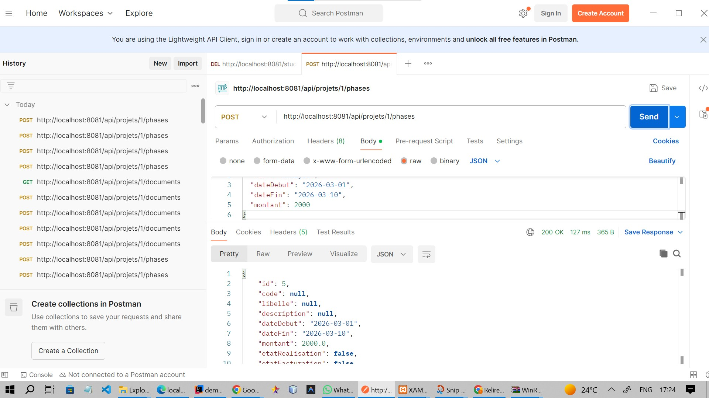

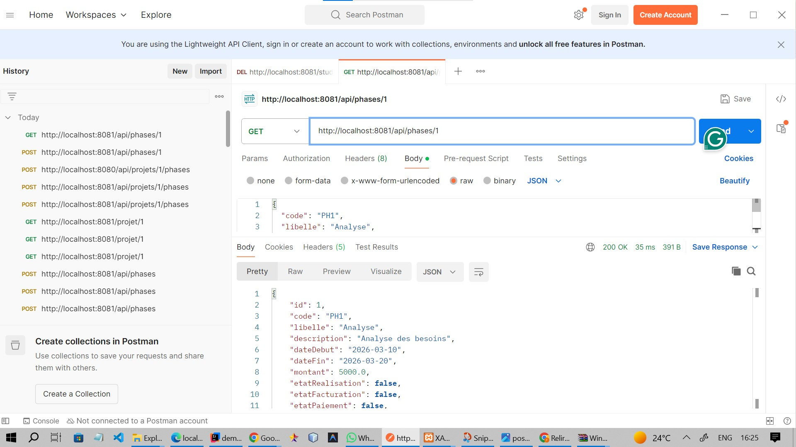

---

## - Phase 8 Gestons des affectations
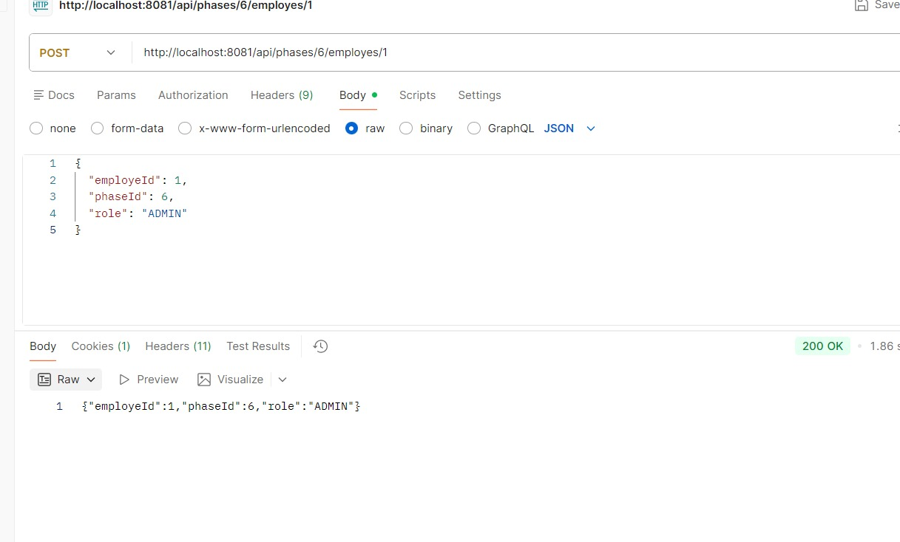

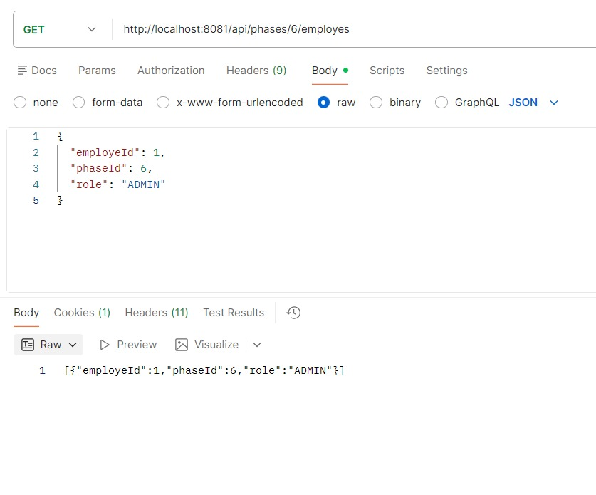

## - Phase 9 — Gestion des livrables

---
## - Phase 10 — Gestion des documents projet 

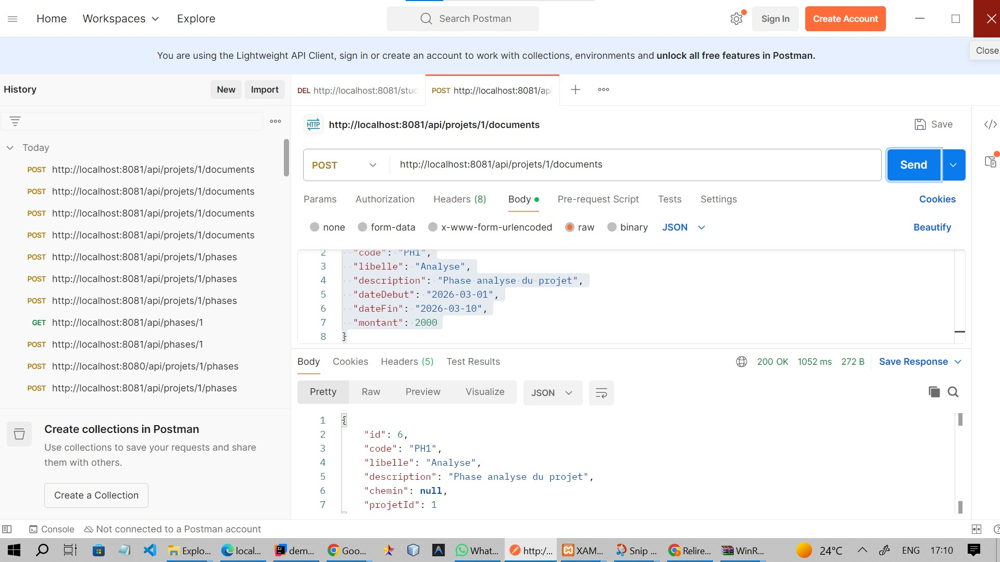

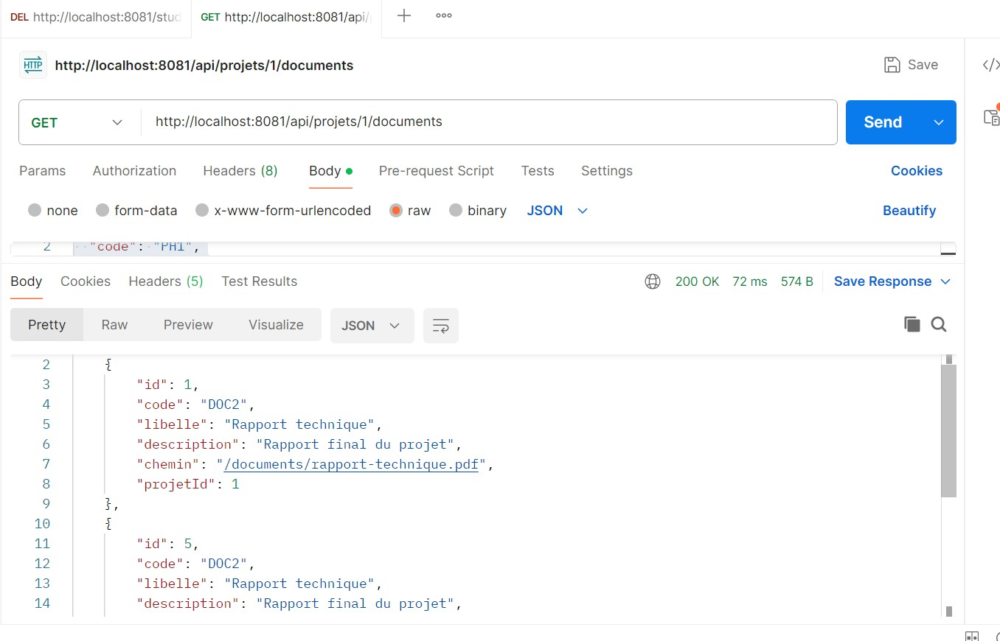

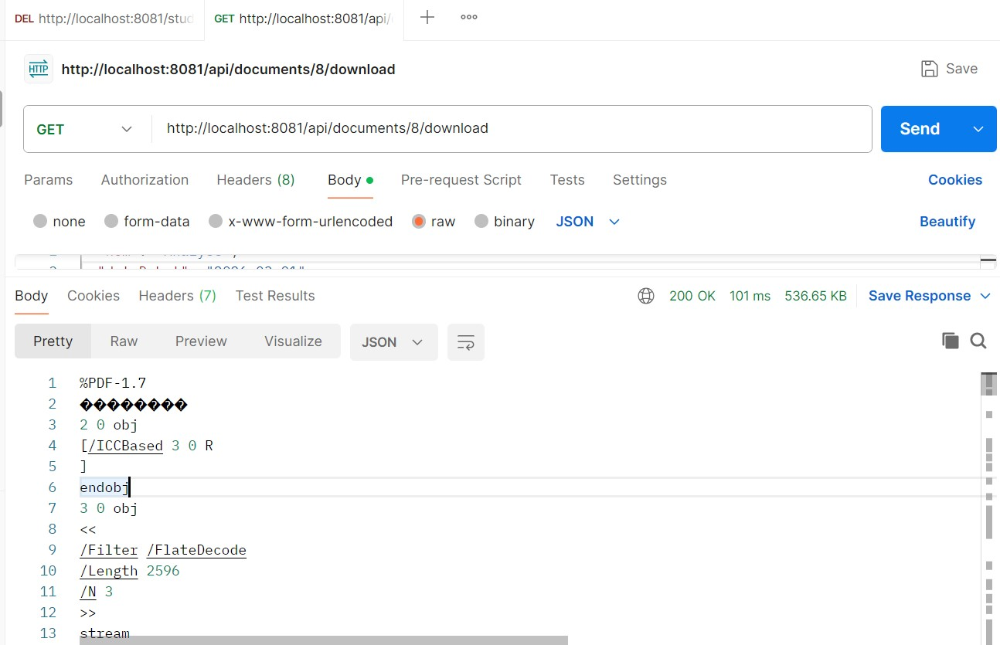

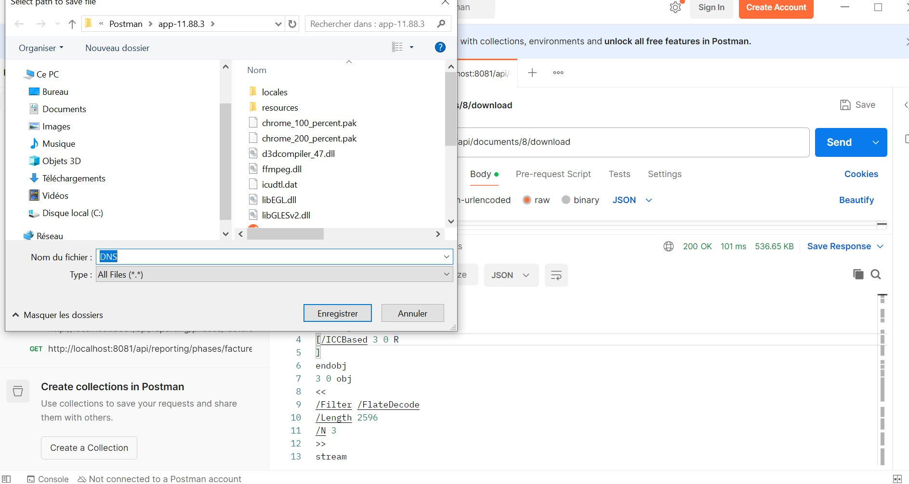

---

## - Phase 11 - Gestion des factures

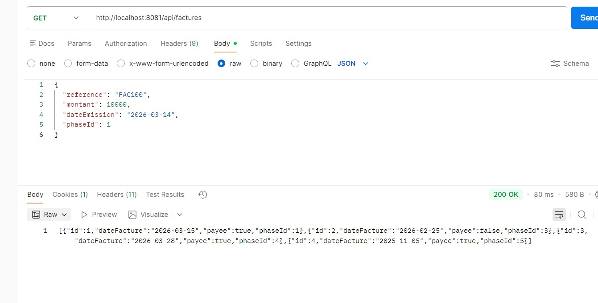

---

## - Phase 12 — Reporting et recherches métier 

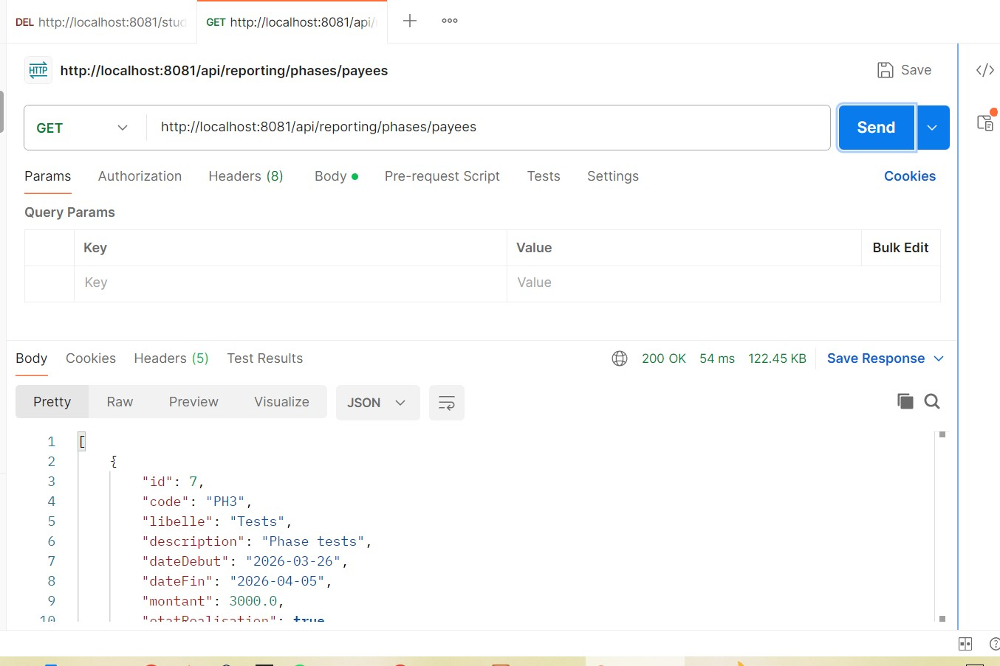

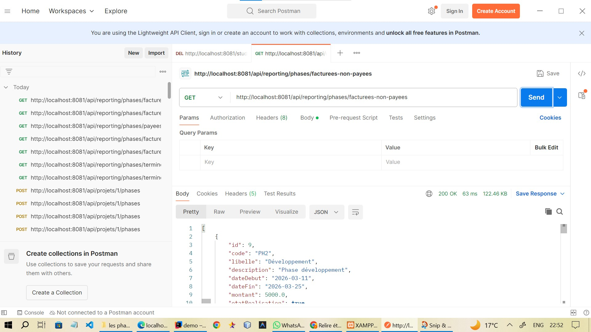

---

## - Phase 13 - gestion des exceptions

### test Swagger

---

---

---

---

## - Phase 14 — Authentification + rôles 

## Deñenstration

https://github.com/user-attachments/assets/063f200d-9906-4413-b502-191b54f65f64

https://github.com/user-attachments/assets/1c97ab62-0e8a-4a56-b611-5a30cee37aa6

 
 

