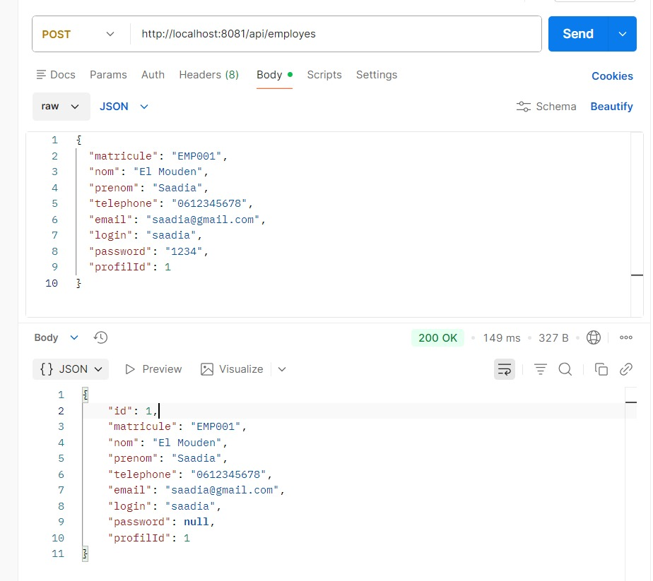
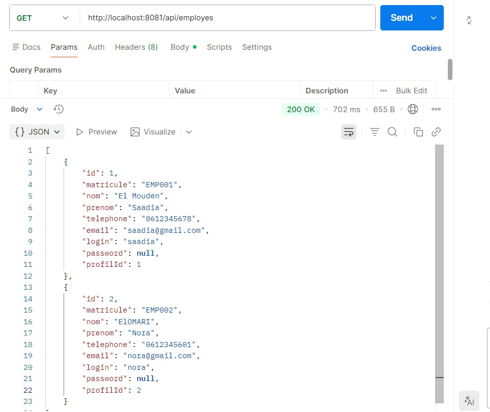
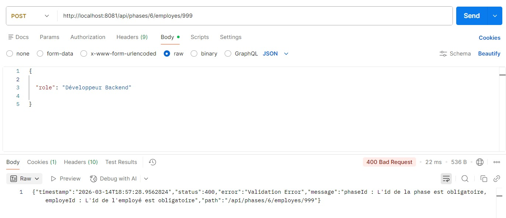

# Plan de travail du projet **Gestion des projets**

## - Phases 1 - 3

Initialisation, BDD, Entités JPA, Repositories

---

## - Phase 4 — Gestion des organismes

---

## - Phase 5 - Gestion des employes

---

## - Phase 6 — Gestion des projets

---

## - Phase 8 Gestons des affectations

Phase 9 — Gestion des livrables

---

## - Phase 11 - Gestion des factures

---

## - Phase 13 - gestion des exceptions

